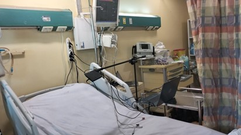

# Contactless Electrocardiogram Monitoring with Millimeter Wave Radar

## Introduction

This project presents a novel approach to contactless electrocardiogram (ECG) monitoring using millimeter-wave radar technology. Our work is inspired by the paper ["Contactless Electrocardiogram Monitoring with Millimeter Wave Radar"](https://ieeexplore.ieee.org/document/9919401) , where they propose innovative methods for remote cardiac activity monitoring. Collaborating closely with the authors, we obtained access to their proprietary (private) dataset, enabling us to implement their model with our own modifications. 
We also collected our own dataset using novel radar sensor and patient monitors.

### Our Research 
 We have prepared a [paper](https://drive.google.com/file/d/1ai_N9FPzX8oqBSh6WalzD2S3FnrtnmHH/view?usp=sharing) to showcase our work to the judges at our department.

## Our Implementation
### Custom Layers

Our implementation includes custom layers crucial for deep learning-based signal processing and feature extraction. These components are tailored to the unique requirements of contactless ECG monitoring with millimeter-wave radar technology:

- **Conv1D**: Customized convolutional layer designed to capture temporal dependencies in radar signals.
- **Maxpool**: Specialized max-pooling layer for downsampling temporal features while preserving relevant information.
- **Conv1DTranspose**: Transposed convolutional layer used for upsampling and feature reconstruction in the temporal domain.
- **BatchNorm**: Batch normalization layer for stabilizing and accelerating the training process.

### Temporal Encoder

The temporal encoder module is dedicated to processing temporal characteristics inherent in radar signals. Leveraging deep learning architectures, it extracts meaningful temporal features crucial for accurately monitoring cardiac activity.

### Spatial Encoder

Incorporating advanced radar signal processing techniques, the spatial encoder segment focuses on capturing spatial information relevant to cardiac monitoring. By analyzing radar reflections, it identifies spatial patterns indicative of cardiac activity.

### Fused ECG Encoder

The fused ECG encoder combines temporal and spatial features extracted from radar signals with conventional ECG data. Through fusion techniques, it generates a comprehensive representation for enhanced cardiac activity monitoring, offering insights into both temporal and spatial aspects of cardiac dynamics.

### LSTM Decoder

The LSTM decoder module utilizes Long Short-Term Memory (LSTM) networks to decode the fused representations into interpretable outputs. By leveraging the memory cell architecture of LSTM, it captures long-term dependencies in the data, enhancing the accuracy of cardiac activity prediction and interpretation.

